## The Product:

This is an online reservation app which helps you book your table in the restaurant whenever you like and you can even check the menu and reviews of that restaurant and even order them.

## Project Duration:

August 2022 - November 2022

## The Problem:

Waiting in lines to reserve table beforehand and checking every restaurant’s menu to see if we like the menu which is very tie consuming.

## The Goal:

The goal is to create an app which makes it easy to reserve restaurant table whenever we want at whatever restaurant we like.

## My Role:

UX/UI designer for Foodie app from conception to delivery.

## Responsibilities:

Conducting interviews, paper and digital wireframing, conducting usability studies, accounting for accessibility.

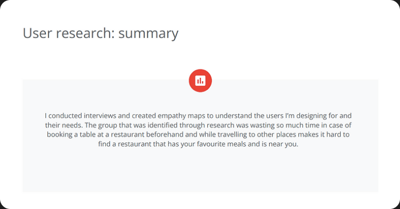

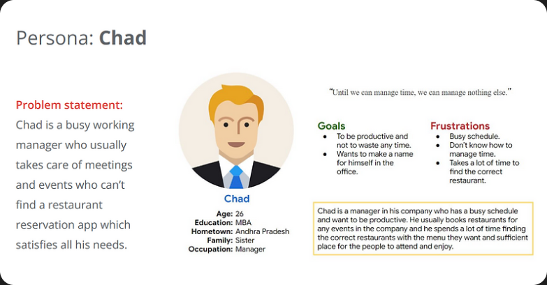

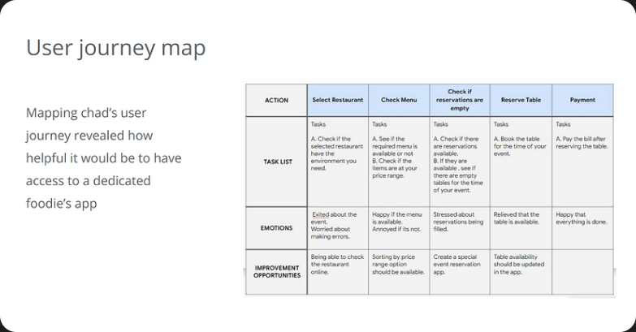

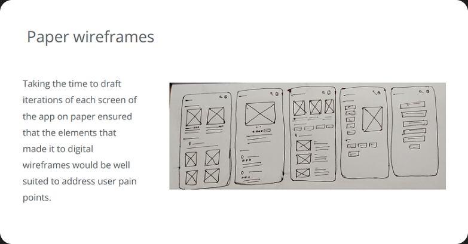

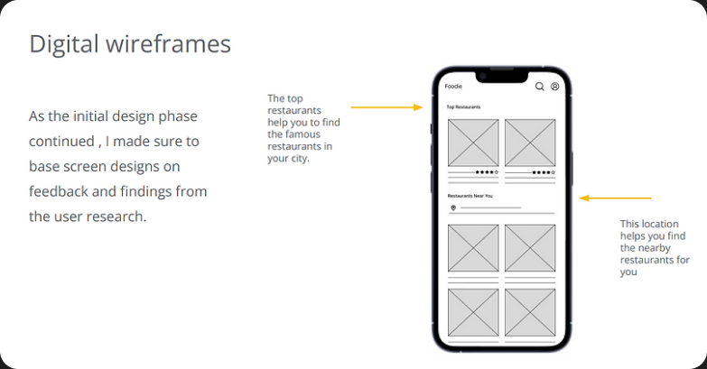

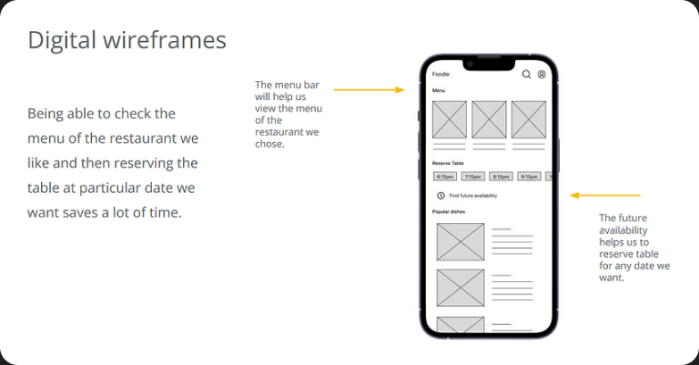

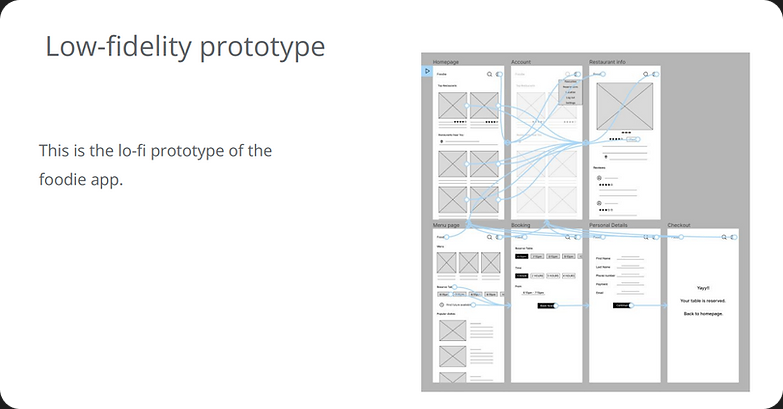

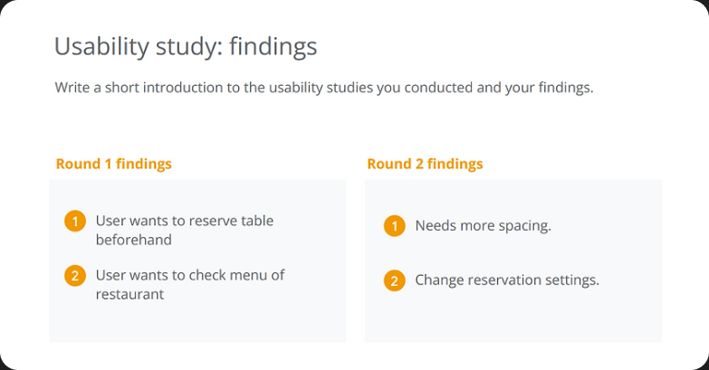

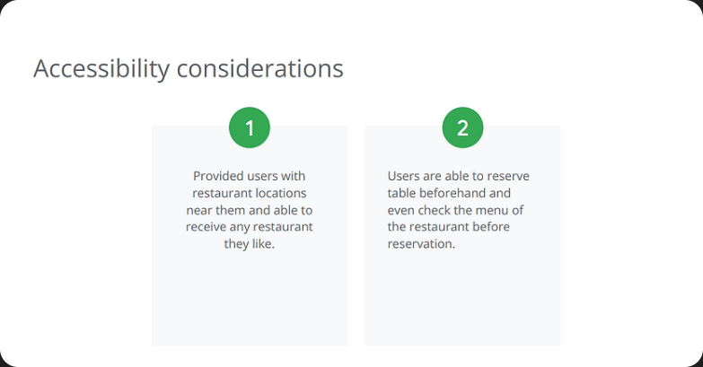

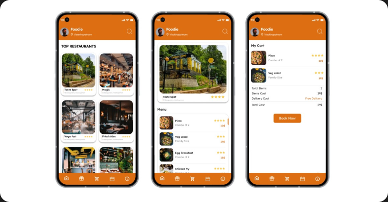

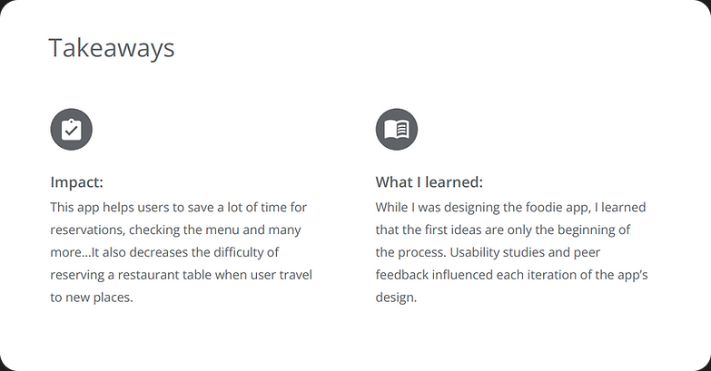

