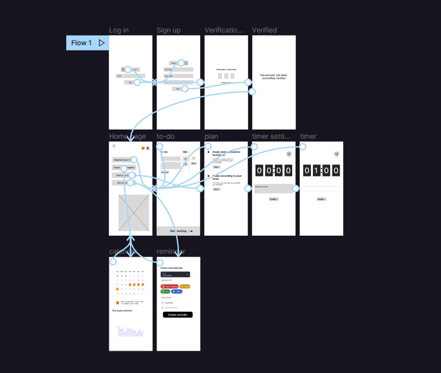
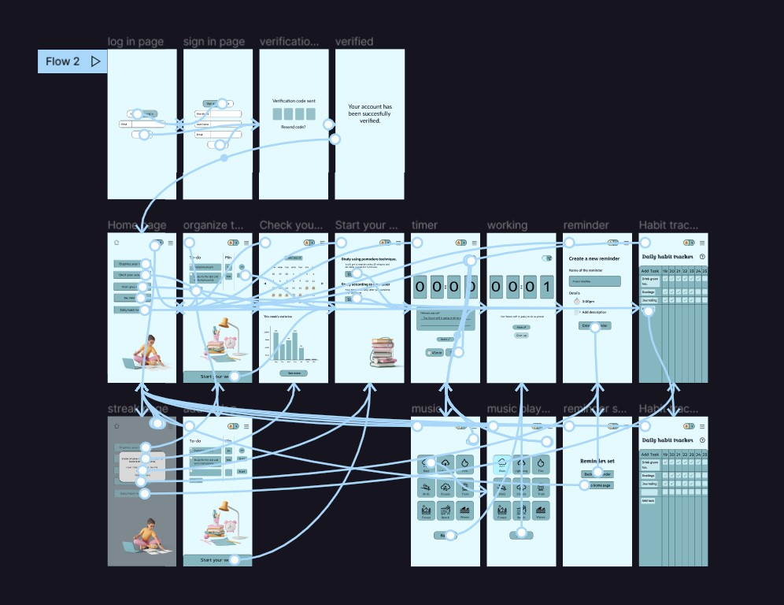
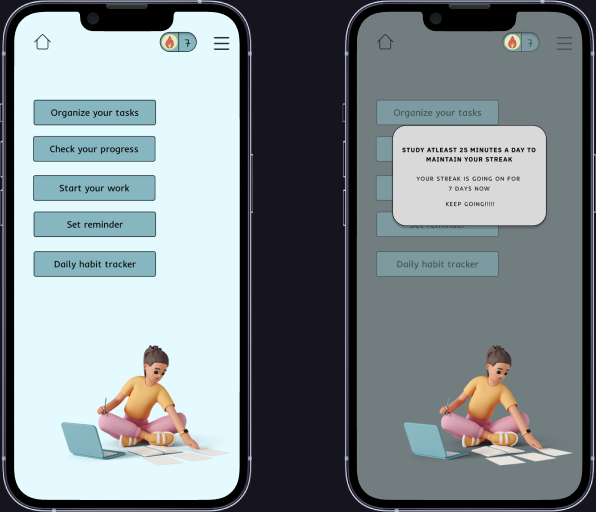
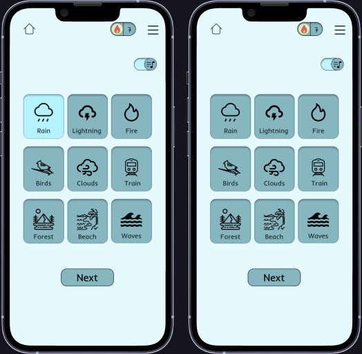
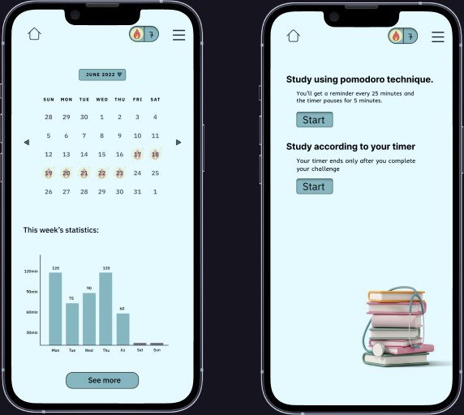
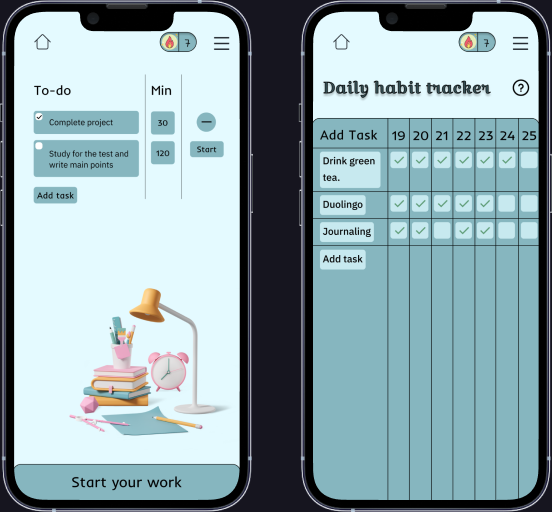
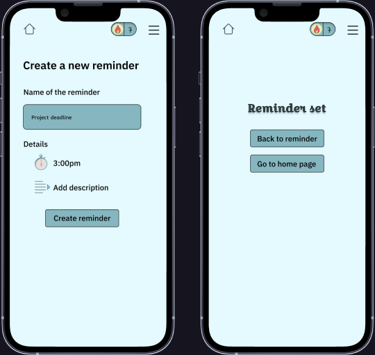
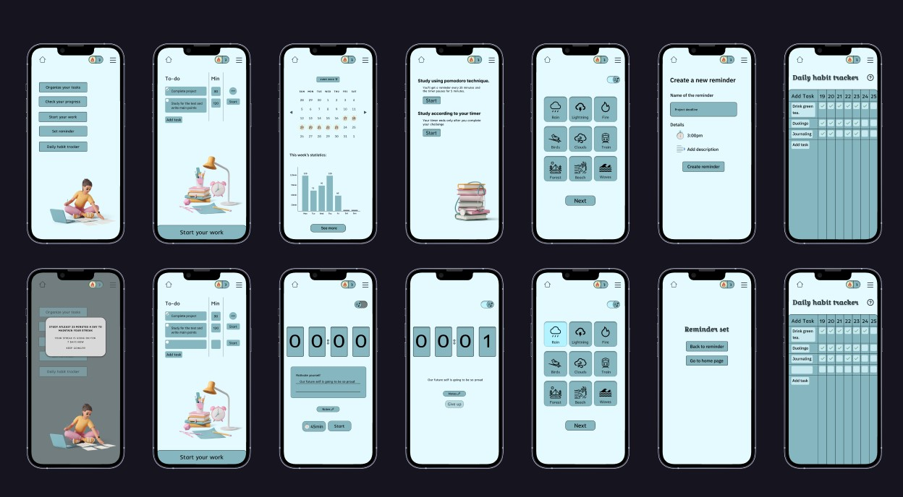

## PROJECT OVERVIEW

This project is about a productivity app which helps people to be productive and focus on their work. Now a days because of the social media we procrastinate a lot. This app helps you to study/work in different methods with peaceful sounds like rain, beach, fire etc. organize your tasks and track your progress, maintain your study streak and much more.

## DESIGN PROCESS

After getting to know about the problem, the first thing i did was to answer these questions myself and by asking others :

- 1. If you can create a productivity app, what things are you gonna add?
- 2. How do you stay focused while working?
- 3. What motivates you?
- 4. How long can you stay motivated?

After the survey, I got few ideas and wrote them down.  I started doing exercises like crazy 8’s and started sketching the ideas and creating story boards. I designed a few lo-fi wireframes and after asking feedback I changed few things and finally ended up with this design. Because of the baseline course I got to know the importance of colors and fonts. I focused more on the colors and fonts. It actually took me some time to choose the color palette for this app and came up with a color which is clean and calming. This app is so simple and easy to understand because it is a productivity app, you definitely don’t wanna waste your time learning how to use it.

## Low Fidelity Wireframes

## High Fidelity Prototype

## FEATURES

## Streak

The 1st thing i came up with is the streak. When you’ve got a streak on snapchat, did you ever intentionally miss a day? Never! Because you don’t wanna lose your streak. You need to study atleast 25 minutes a day to maintain the streak in bubble. You are more likely to do something in order save your streak.

## Nature sounds:

Who doesn’t want to study listening to rain, fireplace, forest sounds etc.. It makes people feel calm and actually enjoys what they’re doing

## Pomodoro Technique and Progress Tracker:

Now- a- days pomodoro technique is quite popular and it is helpful too. If you don’t know what pomodoro technique is , it’s nothing but working with 5 minute breaks every 25 minutes. Looking at the work you did and how many hours you worked is actually kinda motivating.

## To-do list & Habit Tracker:

There are apps that helps you plan your whole day hour to hour, but did u ever followed the whole schedule according to the time you set? So i decided to change that. You list out the works and add the time it takes and work according to that and not like its a schedule. The extra feature is that you can start your work at the to-do list and the timer sets according to the time you assigned for that task. New habits like journaling, drinking green tea daily, study on duolingo are not that boring but sometimes we forget to do them. So daily habit tracker is included in this. These are the key features that help with the user problems.

## Timer & Reminder:

Setting the reminder where the to-do list is, actually a time saver and adding a description of why created the reminder is a plus.

## Final Screens

