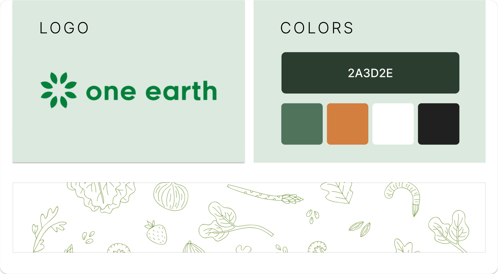
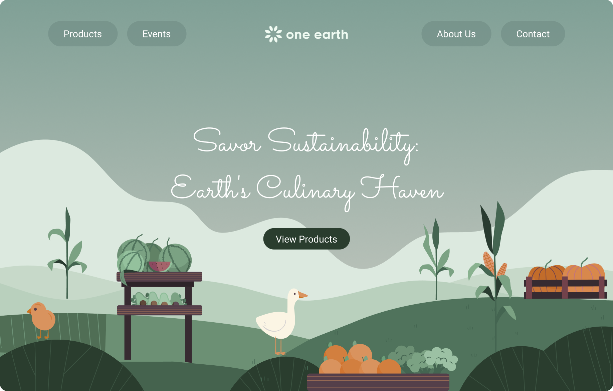
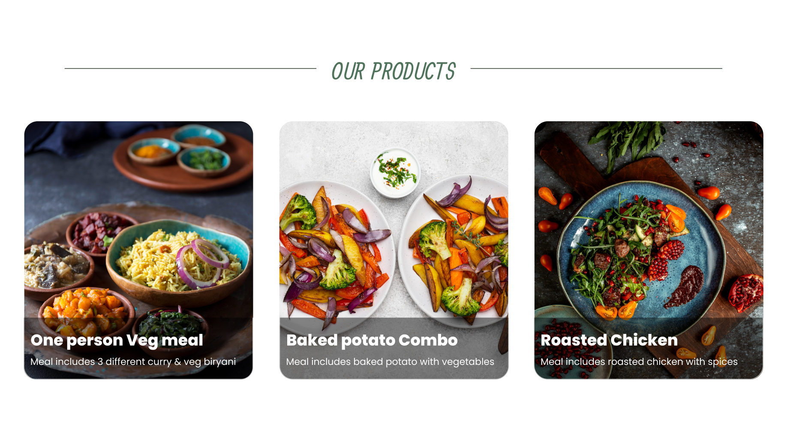
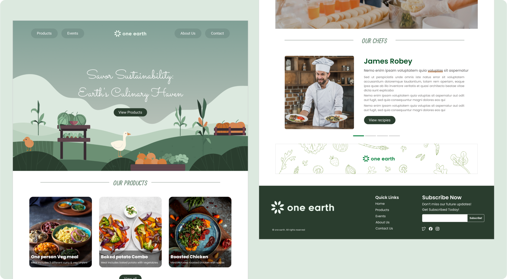

## MY ROLE

UI/UX Designer

## BRAND

One Earth

## Category:

A boutique speciality restaurant

## About the brand

One Earth is a one-of-a kind food experience which seeks to bring together the
local farming community, the gourmand and the restaurant industry together to create a wholly
sustainable ecosystem. Where the menu at the restaurant is dynamic and changes with the season
to ensure that only the freshest produce makes it to the table and the restaurant staff are experts
at not only the sourcing of the ingredients, but the unique recipes and flavours used to bring the
palate of its discerning patrons alive. Providing this singular experience comes at a premium price
point which patrons are happy to pay as they become a part of a community which not only
supports the local farms, and workforce, but they are also presented with a fusion of bringing world

class flavours to local Indian produce and dishes by chefs who are trained at the world’s leading
culinary schools.

