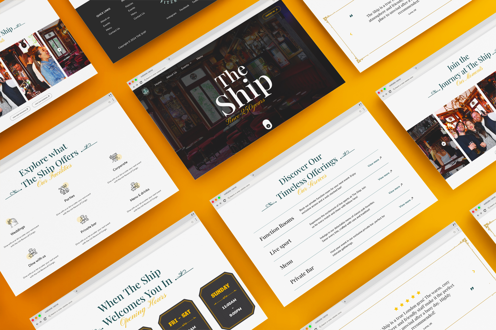

## MY ROLE:
UI/UX Designer

## PROJECT:
The Ship offers a classic London pub experience with great food, live sports, and exclusive event spaces. It highlights its heritage and personalized catering for memorable gatherings.

## Problem Statement:
The Ship, a historic pub with over 250 years of heritage, faced challenges with its outdated website that was outdated and failed to attract or engage visitors, making it difficult for potential customers to discover the pub's unique offerings, such as private event spaces, live sports screenings, and a carefully curated menu. Without proper social media integration or a user-friendly layout, the website struggled to showcase what made "The Ship" special.

## Solution:
I redesigned The Ship’s website to reflect its timeless legacy while embracing a modern aesthetic. The new design features an intuitive layout that highlights The Ship's unique services, from private function rooms and live sports to its diverse menu offerings. Social media integration was incorporated to bring real-time updates and visual stories from Instagram and Facebook directly to the site, fostering stronger connections with the audience. The result is a website that not only looks great but also effectively represents The Ship’s character, making it easier for visitors to connect with everything it has to offer.

