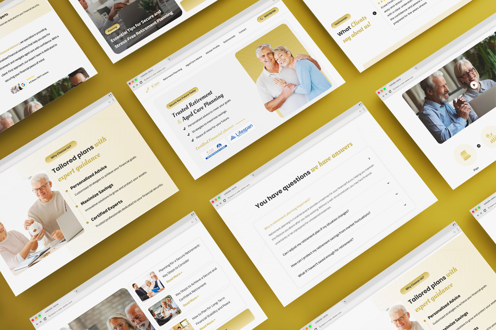

## My Role:

UI/UX Designer - For [Virtual Qube](https://www.vqubetech.com/)

## Project:

The website provides expert financial guidance for aged care, retirement planning, and managing finances, offering personalized support to help families navigate complex decisions and secure their financial future.

## Problem Statement:

iCare Financial Advisory specializes in providing retirement and aged care planning solutions tailored for older individuals. However, their existing digital presence lacked the necessary elements to appeal to this demographic effectively. Older users often find complex designs, small fonts, and inaccessible content overwhelming, reducing engagement and trust. The website needed a redesign to ensure clarity, ease of navigation, and an inviting user experience while maintaining professionalism.

## Solution:

The redesigned website for iCare Financial Advisory incorporates a user-centric approach tailored to the needs of an older audience. Key features include:

Big Fonts and Clear Typography: Ensuring text is legible and easy to read for users with varying levels of eyesight.
Video Integration: Informative and approachable videos simplify complex financial concepts, making content more relatable and engaging.
Simplified Navigation: A clean, straightforward menu and clear call-to-action buttons guide users seamlessly through the site.
Visual Focus: Warm imagery, easy-to-understand icons, and testimonials build trust and emotional connection.

