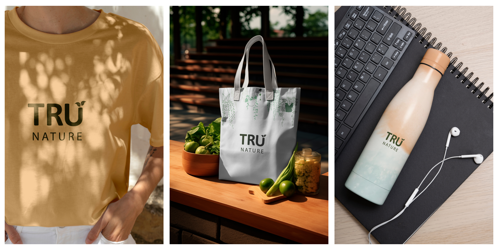
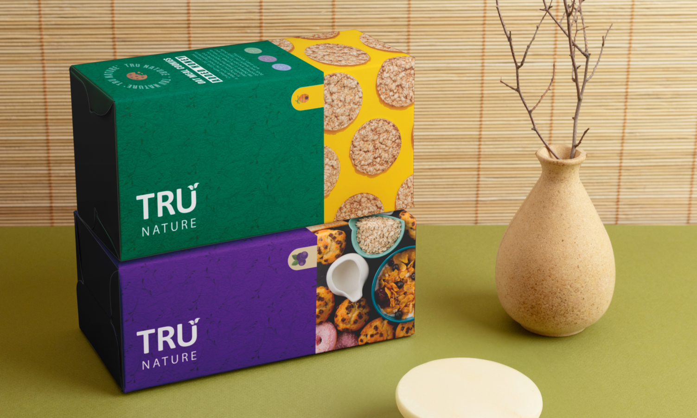
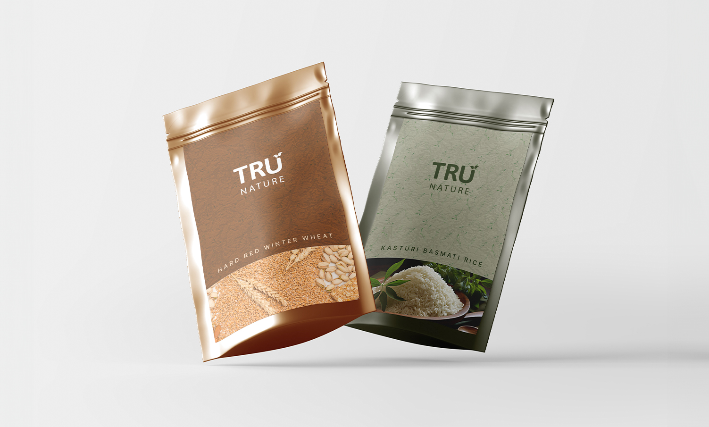
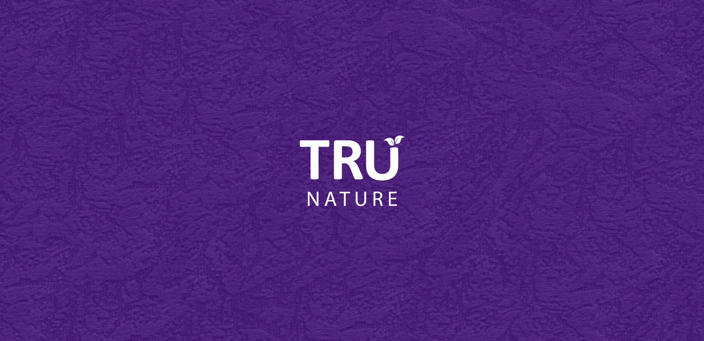

## Product Brief:

An FMCG company wants to launch a new organic food brand called - TRU NATURE. Their product range will include Organic Multigrain Aata, Organic Basmati Rice, Organic Wheat grains, Organic Corn Flour etc. These products will be 20-30% more expensive than the non-organic competitor brands. The clientele for this new brand will be urban, well-educated buyers who are likely to buy it for its added nutritional value and health benefits. These products will be sold through select
channels such as Gourmet Food Stores in affluent neighbourhoods of Tier 1 cities in India, multi-brand retail stores (Nature's Basket, Star Bazaar) and online platforms such as Amazon, BigBasket.

## Logo:

## Cookie packaging:

## Rice and Wheat packaging:

