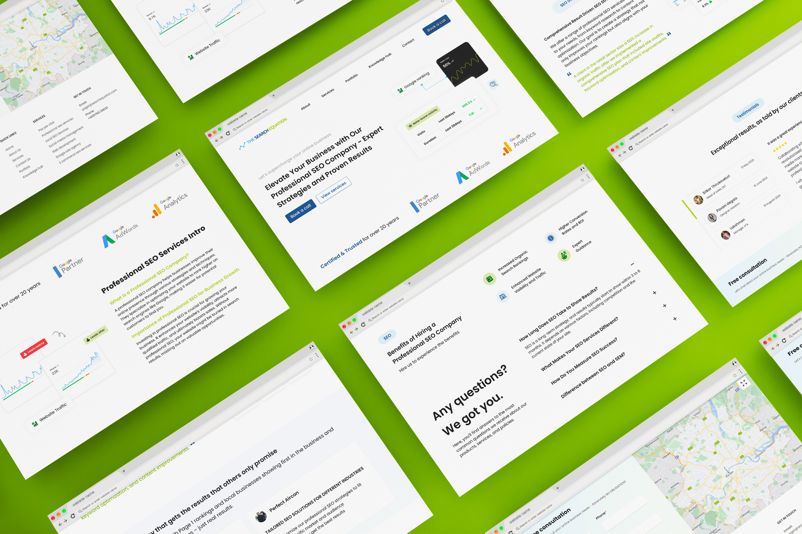
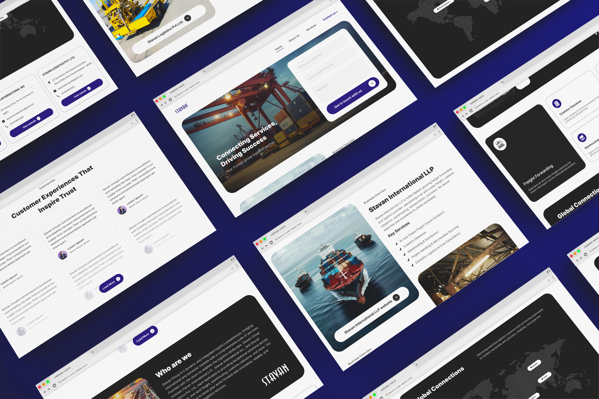

## My Role:

UI/UX Designer

## The Search Equation - For [Virtual Qube](https://www.vqubetech.com/)
The Search Equation is a professional SEO company helping businesses boost online visibility, traffic, and sales with tailored strategies.

## Urban Hospitals
Urban Hospital provides compassionate, advanced healthcare services across various specialties, ensuring high-quality patient care and expert medical attention.

Live link - https://urbanhospitals.in/

## Stavan group - For [Virtual Qube](https://www.vqubetech.com/)
Stavan Group is a logistics provider offering services in freight forwarding, customs clearance, warehousing, transportation, and consultancy across domestic and international markets.

## Cleaners Australia - For [Virtual Qube](https://www.vqubetech.com/)
Cleaners Australia offers expert cleaning services, focusing on end-of-lease, bond, and move-in/out cleaning, ensuring hassle-free, high-quality solutions for homes across Australia

Live Link - [Cleaners Australia](https://cleanersaustralia.com.au/)

## Smiths Lane - For [Virtual Qube](https://www.vqubetech.com/)
Smiths Lane Wines delivers premium quality wines from Australia and New Zealand, offering personalized bottle options

Live Link - [Simths Lane](https://smithslanewines.com.au/)

## MAULI STAYS: Website and app
Mauli Stays is a comprehensive hospitality platform offering hotel bookings with inclusive amenities such as dining options, play areas, and diverse facilities. Our team developed both mobile app and website to enhance the guest experience.

Live link - https://maulistays.com/

## ISH International : Website - In production
IshInternational offers a range of essential products including baby care wipes, towels, and intimate wipes etc.

## Learnings.dev : Website - In production
Learnings.dev is a learnings platform for people who want to code

## Instacraves : Website and app
Instacraves is a traditional coffee shop website which provides different types cofee and tea products.

## MM Mithaiwala : Website,Tablet and app - In production
MM Mithaiwala serves fresh and traditionally tasty food and their products are reasonably priced. We created this in all different screen sizes which are website, application and 2 different tablet sizes

