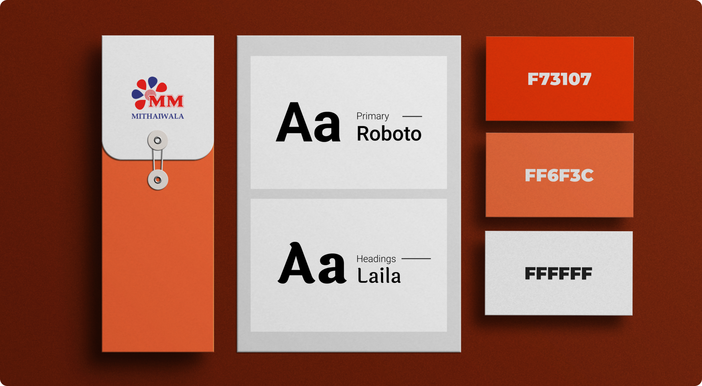

## My Role:

UI/UX Designer

## Client Requirement:

The client, MM Mithaiwala, sought a comprehensive solution comprising a mobile application, a responsive website, and tablet interfaces. The primary goal was to enable seamless online ordering of sweets, ensuring a user-friendly experience across all platforms.

## Scope and Deliverables:

 - Mobile Application: Designed for iOS and Android platforms, featuring over 40 screens tailored to enhance user interaction and streamline the ordering process.
 - Responsive Website: Optimized for various screen sizes, ensuring accessibility and functionality on desktops, tablets, and mobile devices.
 - Tablet Interfaces: Customized interfaces for two tablet screen sizes, maintaining consistency with the mobile and web platforms.

## Brand Guidelines

## App, Website and Tablet screens

