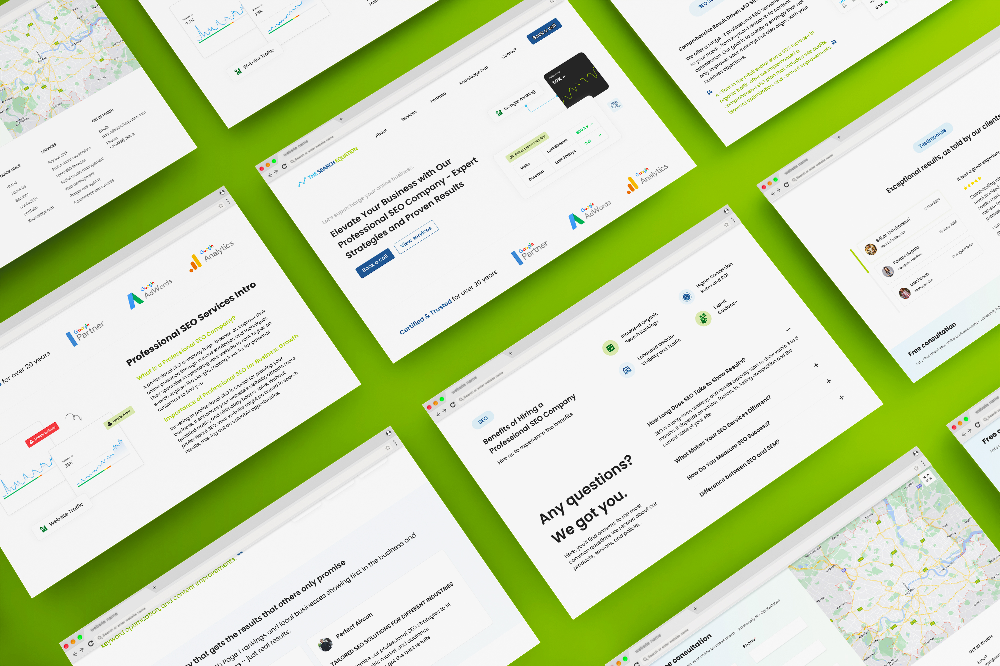

## My Role:

UI/UX Designer

## Project:

The Search Equation is a professional SEO company helping businesses boost online visibility, traffic, and sales with tailored strategies.

## Problem Statement:

The Search Equation, an established SEO and digital marketing agency with over 20 years of expertise, required a website that reflected its professional reputation while standing out in a competitive market. The existing platform lacked the minimal, clean, and modern design needed to appeal to clients seeking tailored SEO solutions. It needed to effectively showcase the agency’s proven track record, comprehensive services, and data-driven results in a way that was engaging, user-friendly, and informative

## Solution:

I redesigned The Search Equation’s website with a focus on minimalism and clarity, ensuring that the design aligns with its expertise in delivering impactful SEO strategies. The new layout emphasizes key service offerings, proven results, and client success stories through visually appealing metrics, testimonials, and case studies. Interactive elements, such as booking a consultation and accessing tailored resources, make it easy for users to engage. By streamlining navigation and creating a professional aesthetic, the redesign positions The Search Equation as a trusted partner for businesses looking to elevate their online visibility and drive measurable results

