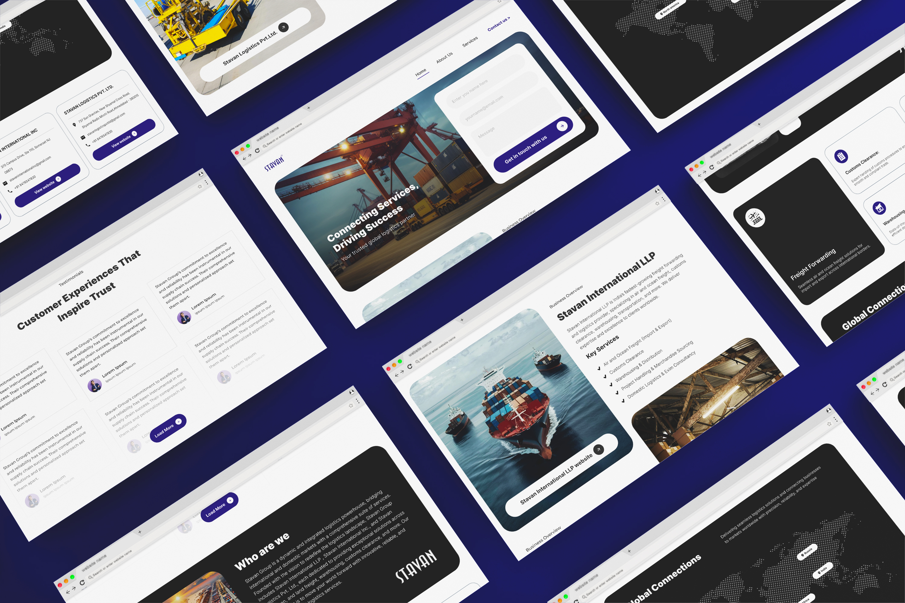

## My Role:

UI/UX Designer

## Project:

Stavan Group is a logistics provider offering services in freight forwarding, customs clearance, warehousing, transportation, and consultancy across domestic and international markets.

## Problem Statement:

The Stavan Group, a leading name in logistics, needed a dedicated third website to represent its growing portfolio of companies and services. With each existing website tailored to specific business arms, this new platform was required to seamlessly showcase the group's overarching vision, comprehensive service offerings, and global presence. The challenge was to create a user-friendly and professional design that consolidates the group's diverse expertise while maintaining clarity and accessibility for potential clients.

## Solution:

I designed a modern, cohesive website for the Stavan Group that reflects its dynamic identity and global reach. The site features an intuitive layout, presenting the group’s key services, such as freight forwarding, customs clearance, warehousing, and domestic logistics, in an organized and visually engaging manner. By incorporating dynamic content, including testimonials and interactive maps highlighting global connections, the design communicates the group's reliability and expertise. This new website effectively serves as a central hub, bridging Stavan Group’s multiple business entities and enabling clients to explore their offerings seamlessly.

