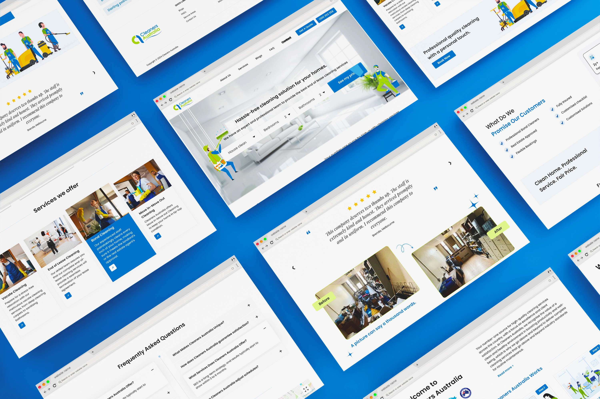

## My Role:

UI/UX Designer - For [Virtual Qube](https://www.vqubetech.com/)

## Project:

Cleaners Australia offers expert cleaning services, focusing on end-of-lease, bond, and move-in/out cleaning, ensuring hassle-free, high-quality solutions for homes across Australia

## Problem Statement:

Cleaners Australia, a leading provider of professional cleaning services, required a website that could effectively communicate its expertise, reliability, and customer-centric approach. The goal was to create a platform that not only showcased the wide range of services offered but also made it simple for customers to book services, get quotes, and access helpful resources. The challenge was to design a user-friendly website that reflects the company’s professionalism and commitment to excellence while engaging a diverse audience.

## Solution:

I redesigned the Cleaners Australia website with a modern, clean, and intuitive layout to enhance user experience and build trust with potential customers. The new design features streamlined navigation, easy-to-use booking and quote tools, and visually engaging sections to highlight services. Real-time customer testimonials, before-and-after visuals, and a clear "How It Works" guide were added to boost credibility and transparency. The updated website now serves as a comprehensive and professional digital hub, making it easier for clients to explore services, make informed decisions, and book hassle-free cleaning solutions.

View website - [Cleaners Australia](https://cleanersaustralia.com.au/)